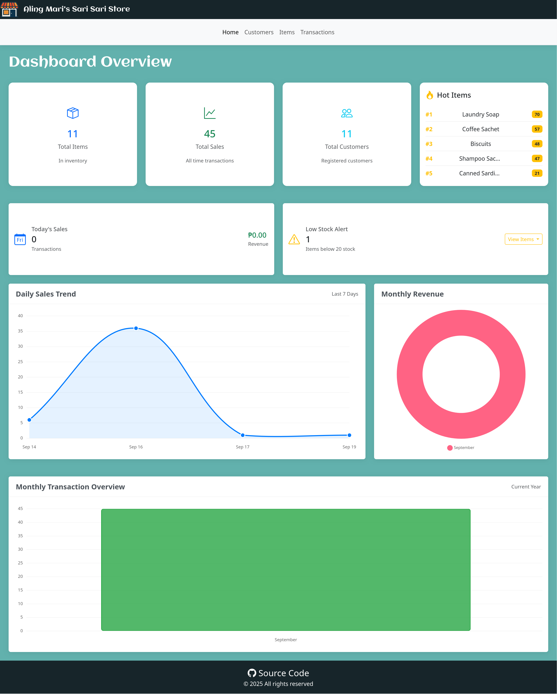
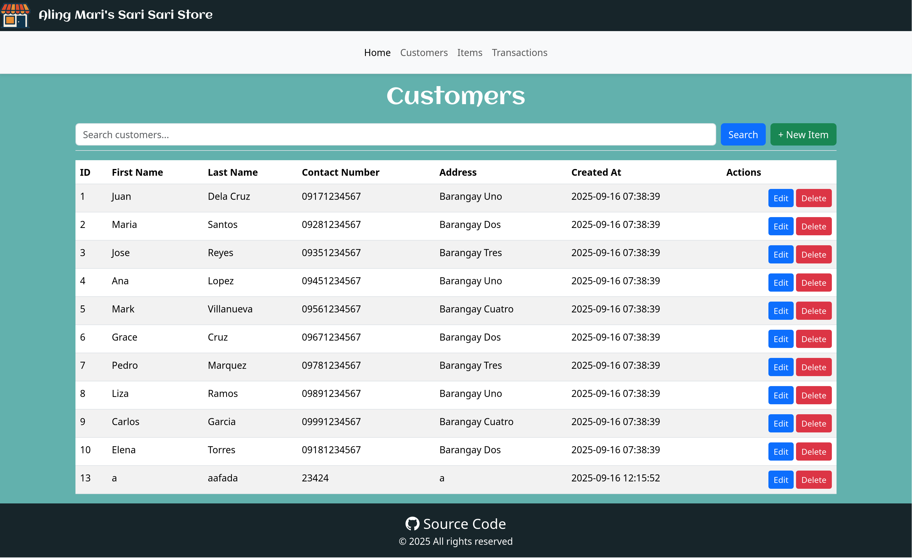

# Sari-Sari Store


A simple store managament system built with LAMP stack.

## Features

- Table views for all your customers, inventory items, and transactions data
- Charts
- Search Function
- Add, edit, and delete data

## Screenshots




## Tech Stack

- **Frontend:** Bootstrap 5
- **Backend:** Apache, PHP
- **Database:** MySQL
- **Other:** Chart.js

## Getting Started

### Prerequisites

- Docker and Docker Compose
- MySQL (or just use Docker for database)

### Installation

```bash
# Clone the repository
git clone https://github.com/Soljira/Sari-Sari-Store.git
cd Sari-Sari-Store

# Start with Docker Compose
docker-compose up -d

# The application will be available at http://localhost:8080/
```

Website: http://localhost:8080
<br>Adminer: http://localhost:8081

## Project Structure

```
├── assets/
│   ├── docs/
│   ├── fonts/
│   ├── images/
│   ├── scripts/            # Database utility functions
│   └── styles/             # CSS and styling
├── docker-compose.yml      # Multi-container setup
├── Dockerfile              # Docker configuration
├── sari-sari-store.sql     # Initial Database
└── src/
    ├── components/         # Reusable UI components
    ├── services/           # Utility functions
    │   └── crud/   
    └── views/              # Page views
```

## Support

- 📧 Email: soljiragit@gmail.com
- 🐛 Issues: [GitHub Issues](https://github.com/Soljira/Sari-Sari-Store/issuess)

## License

This project is licensed under the MIT License - see the [LICENSE](LICENSE) file for details.

---

⭐ If you found this project helpful, please give it a star on GitHub!